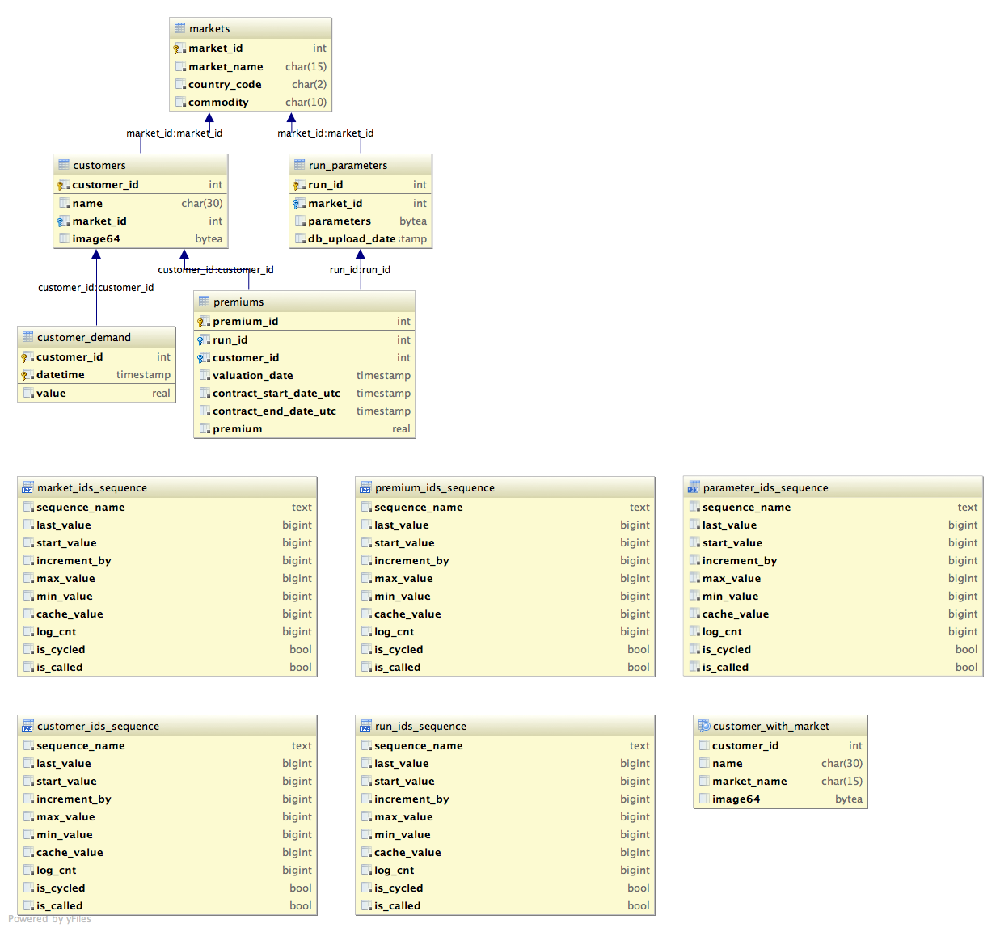

Documentation for this package can be found here:

    http://davidsimpson1980.github.io/flaskr

From start to finish (for Mac OSX)
==================================

Mac OSX come with python already installed.  For a number of reasons I prefer to
use Anaconda from continuum which you can download here <link>.  I will assume
that you install it to the /Applications/ folder

You can check which version of python is being used by running the following:

    $ which python

Which should return:

    /Applications/anaconda/bin/python

If you used the standalone anconda installer this should already be the case.  If
not you will need to add the following line to the start of your .bash_profile
in your home directory:

    export PATH="/Applications/anaconda/bin:$PATH"

this adds the path to your python installation to the start of the PATH
environment variable.

TODO: Include details for install postgres.app and postgresadmin

This uses the conda command to track package installations and dependencies.  I
have compiled a number of packages and uploaded them to binstar that can be
found here.

To make sure conda is aware of this repository you will need to make a .condarc
file in your user directory.  This can be done quite easily by running:

    $ cd
    $ touch .condarc
    $ nano .condarc

The detailed instructions can be found here but in brief the .condarc file
should look something like this:

    # This is the default conda runtime configuration

    # channel locations. These override conda defaults, i.e., conda will
    # search *only* the channels listed here, in the order given here

    channels:
      - http://repo.continuum.io/pkgs/free/
      - http://repo.continuum.io/pkgs/pro/
      - https://conda.binstar.org/dsimpson1980/

you will need to install the following packages:

    $ conda install pandas (this will install numpy)
    $ conda install flask-sqlalchemy (this will install flask and sqlalchemy)
    $ conda install wtforms (from my repo above)

Unfortunately, I haven't yet compiled the celery <link> package so it will need
to be installed using pip:

    $ pip install celery

Deployment to Heroku
====================

Sign up to an account on Heroku

Open a terminal and naviagate to the root of your project

Download and install the heroku toolbelt

Run $ heroku login
Enter your Heroku credentials.
Email: mapdes@gmail.com
Password (typing will be hidden):
Authentication successful.

The buildpack is located here: https://github.com/dbrgn/heroku-buildpack-python-sklearn

We're creating a new app from scratch so the command is:

    $ heroku create  --buildpack https://github.com/dbrgn/heroku-buildpack-python-sklearn/

To create the app and add it as a remote repository for git

Comment out matplotlib and pandas from requirements before pushing to heroku for first time
Add above two pkgs back in that will now use cached numpy compilation

To be able to detect what environment the app is being run on, add the following
environmental variable in heroku:

    $ heroku config:set HEROKU=1

To create the database addon:

    $ heroku add:add heroku-postgresql:dev

The initialise the database and to populate it with the structure in schema.sql

    $ heroku run init

Run the below to promote the database to DEFAULT i.e. DATABASE_URL:

    $ heroku pg:promote HEROKU_POSTGRESQL_color_URL

Promoting HEROKU_POSTGRESQL_COLOR_URL (DATABASE_URL) to DATABASE_URL... done

Run the below to start the celery worker:

    $ heroku run worker

Database schema structure
=========================

The postgres database has the schema structure outlined in the database below:

   UML diagram of the retail schema in the postgres database

This structure can also be read in the schema.sql file that is used to initialise the database